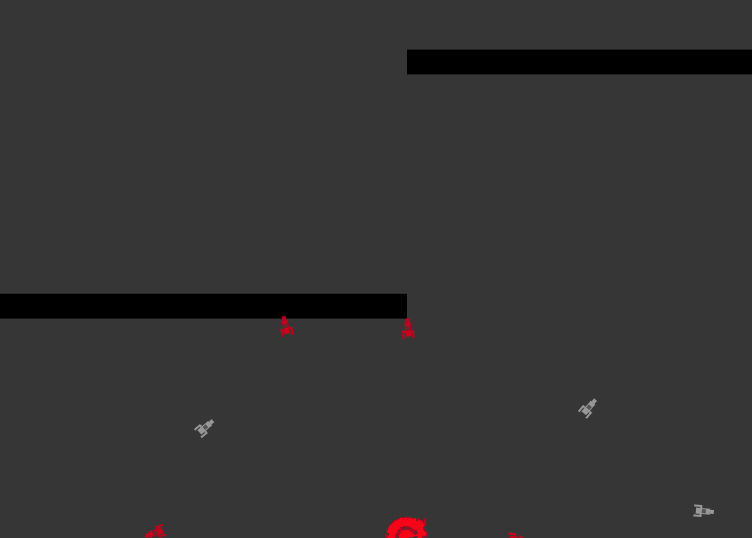
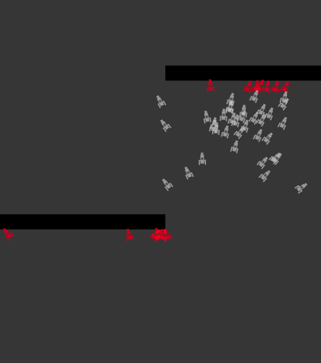
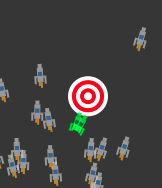

# Smart Rockets

## Problem

To train a `Rocket` to reach a target given an environment with `Obstacles`

## Environment

#### `Rocket`

Each `Rocket` :

*   looks like this:

    
*   starts at the bottom of the page
*	has a lifespan during which it continues to move
*	can crash into an `Obstacle` or the edge of the world
*	can complete the task on hitting the target

#### `Obstacle`

In this simple case there are 2 obstacles.
A `Rocket` is said to crash into an obstacle if their shapes overlap

## Method

Our approach is based on the concept of genetic algorithms.

#### `DNA`

Each `Rocket` is assigned a `DNA` which is an `Array` of random `2DVectors`
The `Rocket`'s movement is governed by its `DNA`

Mutation occurs in a manner in which each gene can be mutated at a particular rate, prior to calculating fitness.

#### `Population`

At first, the `Population` comprises of `Rocket`s with completely random `DNA`.

Given $x$ the normalized distance between the target and the `Rocket` at the end of its lifespan,

$f(x) = \begin{cases} (1-x)^4 * 1000 &\text{if } completed \\ (1-x)^4 * 10 &\text{if } crashed \end{cases}$

This fitness function defines the probability of choosing a `Rocket` as one of the 2 parents of the next generation of the `Population`

Due to this, the new generation of the `Population` has a very high probability of having very similar `DNA` to the best `Rockets` of the previous generation.

Finally, they reach the target

## Implementation

This simulation was implemented in [JavaScript](https://www.javascript.com/) with the [Processing](https://p5js.org) graphics library.